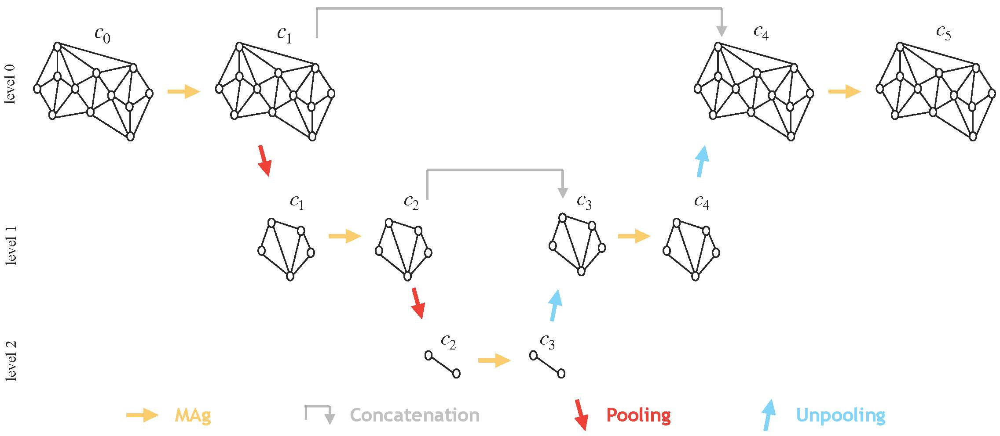

## MAgNET: A Graph U-Net Architecture for Mesh-Based Simulations  

This repository provides the implementations of "[MAgNET: A Graph U-Net Architecture for Mesh-Based Simulations](https://www.sciencedirect.com/science/article/pii/S0952197624002136?via%3Dihub)".

MAgNET is a graph U-Net architecture composed of two novel deep learning layers. The first layer is the Multichannel Aggregation (MAg) layer, which expands upon the idea of multichannel localized operations in convolutional neural networks to accommodate arbitrary graph-structured inputs. And second type of layers are pooling/unpooling layers, designed to facilitate efficient learning on high-dimensional inputs by utilizing reduced representations of arbitrary graph-structured inputs.

<br />



<br />

Supplementary data for the paper is available on [](https://doi.org/10.5281/zenodo.7784804).


<br />

## Dependencies

Scripts have been tested running under Python 3.9.5, with the following packages installed (along with their dependencies). In addition, CUDA 10.1 and cuDNN 7 have been used.


- `tensorflow-gpu==2.4.1`
- `keras==2.4.3`
- `numpy==1.19.5`
- `pandas==1.3.4`
- `scikit-learn==1.0.1`

All the finite element simulations are performed using the [AceFEM](http://symech.fgg.uni-lj.si/Download.htm) library.

<br />

## Cite

Cite our paper if you use this code in your own work:

```
@article{DESHPANDE2024108055,
title = {MAgNET: A graph U-Net architecture for mesh-based simulations},
journal = {Engineering Applications of Artificial Intelligence},
volume = {133},
pages = {108055},
year = {2024},
issn = {0952-1976},
doi = {https://doi.org/10.1016/j.engappai.2024.108055},
url = {https://www.sciencedirect.com/science/article/pii/S0952197624002136},
author = {Saurabh Deshpande and Stéphane P.A. Bordas and Jakub Lengiewicz},
keywords = {Geometric deep learning, Mesh based simulations, Finite element method, Graph U-Net, Surrogate modeling}
}
```

<br />
